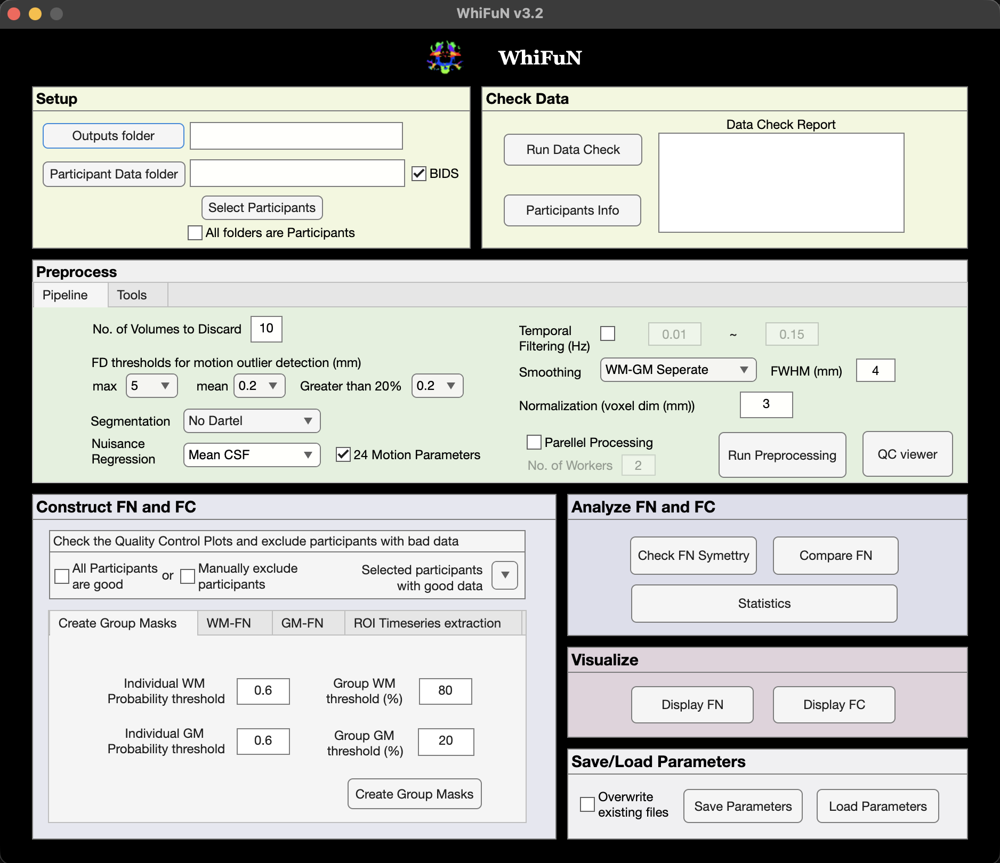

Getting Started
===============

Prerequisites
-------------
For Version 3, ``MATLAB R2022a`` or later is recommended.

Required MATLAB toolboxes
~~~~~~~~~~~~~~~~~~~~~~~~~

- Image Processing Toolbox
- Signal Processing Toolbox
- Statistics and Machine Learning Toolbox
- Bioinformatics Toolbox (required for ``mafdr`` FDR correction)

Optional MATLAB toolbox
~~~~~~~~~~~~~~~~~~~~~~~

- Parallel Computing Toolbox (recommended for faster processing)

All toolboxes can be installed through MATLAB Add-Ons:
https://www.mathworks.com/help/matlab/matlab_env/get-add-ons.html

Install SPM
-------------

1. Download SPM from:
   https://github.com/spm/spm/releases/tag/25.01.02
2. Add SPM to your MATLAB path using one of the methods below.

**Option A (recommended, persistent):**

- MATLAB ``Home`` tab -> ``Environment`` -> ``Set Path``
- Click ``Add Folder``
- Select the SPM folder containing ``spm.m``
- Click ``Save`` -> ``Close``

**Option B (temporary, command window):**

.. code-block:: matlab

   addpath('<path to spm folder>')

Download WhiFuN
---------------

1. Go to: https://github.com/Brain-Connectivity-Lab/WhiFuN
2. Click the green ``Code`` button -> ``Download ZIP``
3. Extract the ZIP to a local folder

Add WhiFuN to MATLAB Path
-------------------------

After extraction, add the WhiFuN folder (the one containing ``whifun.m``)
to the MATLAB path.

**Option A (recommended, persistent):**

- MATLAB ``Home`` tab -> ``Environment`` -> ``Set Path``
- Click ``Add Folder``
- Select the WhiFuN folder containing ``whifun.m``
- Click ``Save`` -> ``Close``

**Option B (temporary, command window):**

.. code-block:: matlab

   addpath('<path to WhiFuN folder>')

Launch WhiFuN
-------------

Once SPM and WhiFuN paths are added, run:

.. code-block:: matlab

   whifun

The main WhiFuN GUI will open.

   WhiFuN v3.2 main GUI.
